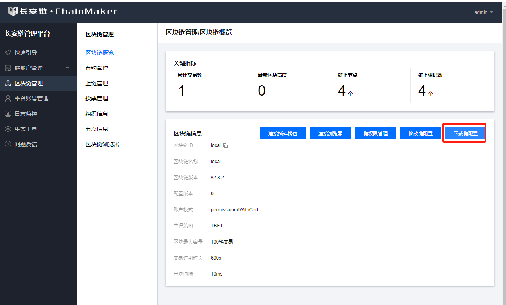
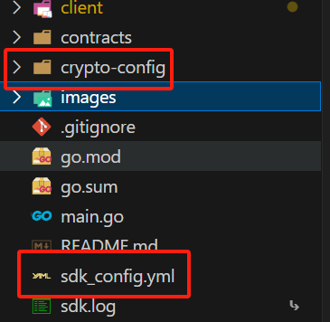
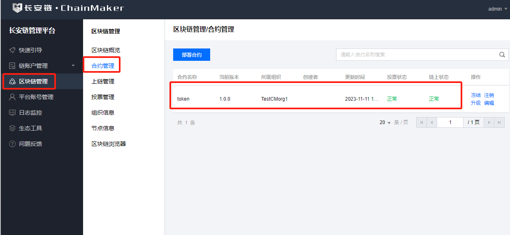

服务器部署：

```bash
docker run --rm -v "$PWD":/usr/src/myapp -w /usr/src/myapp golang:1.20 bash -c 'go env -w GO111MODULE=on && go env -w GOPROXY=https://goproxy.cn,direct && go build -v'
nohup ./carservice &
```

下载配置文件：


将配置文件解压到根路径下，并根据项目目录修改配置文件的路径


然后直接运行：

```golang
go run main.go
```

如果合约没有部署，则会部署合约

```bash
2023/11/11 15:35:23 chain client initialize successfully
合约[token]不存在
====================== 创建合约 ======================
2023/11/11 15:35:24 contract_result:<result:"\n\005token\022\0051.0.0\030\005*\226\001\n\nTestCMorg1\020\001\032 \357\377\010\250\271\243\2570\017\201\350\367\221\311\261\177\200\211\017;g\337M,\226\0243\222!:\364\305\"\033cmtestuser1.sign.TestCMorg1*\005ADMIN2@3eddab9da000facf9b3fc840660748cdb49b2ef303c995853bf6f3a2d18945112(6795f86e288bc16c31d22f9ea23955224121d74d" gas_used:1061794 contract_event:<topic:"ddf252ad1be2c89b69c2b068fc378daa952ba7f163c4a11628f55a4df523b3ef" tx_id:"17968157d5691844ca5656f4803126714e7174eb62be44c3b2cc0b211c7bc54e" contract_name:"token" contract_version:"1.0.0" event_data:"0000000000000000000000000000000000000000000000000000000000000000" event_data:"0000000000000000000000000000000000000000000000000000000000000000" event_data:"000000000000000000000000000000000000000000000000016345785d8a0000" > > tx_id:"17968157d5691844ca5656f4803126714e7174eb62be44c3b2cc0b211c7bc54e" tx_timestamp:1699688123 tx_block_height:2
addr [470532945834136871529055253531705118185281158937] => [%!d(string=0)]
2023/11/11 15:35:24 ethaddr => 0x526b6d51426e2603b97880cf44d9b34ae5e5ff19
2023/11/11 15:35:24 skiaddr => 3eddab9da000facf9b3fc840660748cdb49b2ef303c995853bf6f3a2d1894511

```

合约部署成功则可以在管理平台中查看合约


// 初始化数据库数据

```
go test -v infra/database/database_test.go -run TestPrePareHighwayData
go test -v infra/database/database_test.go -run TestPrePareChargeData
go test -v infra/database/database_test.go -run TestPrePareParkData
```

生成 QRCode 的 text，然后去草料二维码生成二维码
https://cli.im/text

```
go test -v util/rsa_test.go -run TestGenerateQRCodeText
```

## highway Qrcode

高速入口:


高速出口:


充电桩，开始充电


充电桩，结束充电


停车，开始停车


停车，结束停车

